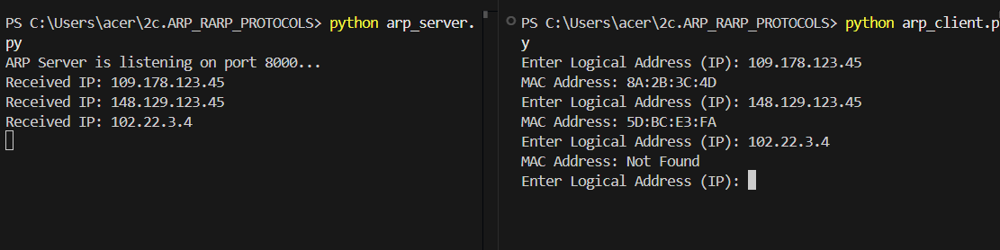
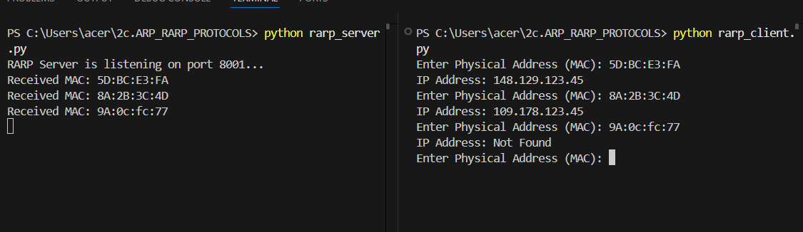

# 2c.SIMULATING ARP /RARP PROTOCOLS
## AIM
To write a python program for simulating ARP protocols using TCP.
## ALGORITHM:
Algorithm: ARP Server
Objective: To receive an IP address from the client and send the corresponding MAC address.

Algorithm Steps:

Start the program.

Create a TCP socket.

Bind the socket to the local host and port number 8000.

Put the server socket into listening mode.

Display a message indicating the server is ready.

Accept a connection request from the client.

Initialize a table containing IP address – MAC address pairs.

Repeat the following steps:

•Receive the IP address from the client.

•Search the received IP address in the ARP table.

•If the IP address is found, get the corresponding MAC address.

•If the IP address is not found, set the response as "Not Found".

•Send the MAC address (or "Not Found") back to the client.

Continue until the connection is terminated.

Stop the program.

Algorithm: ARP Client
Objective: To send an IP address to the server and receive the corresponding MAC address.

Algorithm Steps:

Start the program.

Create a TCP socket.

Connect the socket to the server using localhost and port number 8000.

Repeat the following steps:

•Read the logical address (IP address) from the user.

•Send the IP address to the server.

•Receive the MAC address from the server.

•Display the received MAC address.

Continue until the user terminates the program.

Stop the program.

Algorithm: RARP Server
Objective: To receive a MAC address from the client and return the corresponding IP address.

Algorithm Steps:

Start the program.

Create a TCP socket.

Bind the socket to localhost and port number 8001.

Put the socket into listening mode.

Display a message indicating that the RARP server is ready.

Accept a connection request from the client.

Initialize a RARP table containing MAC address – IP address pairs.

Repeat the following steps:

•Receive the MAC address from the client.

•Search the MAC address in the RARP table.

•If the MAC address is found, retrieve the corresponding IP address.

•If the MAC address is not found, set the response as "Not Found".

•Send the IP address (or "Not Found") back to the client.

Continue until the connection is terminated.

Stop the program.

Algorithm: RARP Client
Objective: To send a MAC address to the server and receive the corresponding IP address.

Algorithm Steps:

Start the program.

Create a TCP socket.

Connect the socket to the server using localhost and port number 8001.

Repeat the following steps:

•Read the physical address (MAC address) from the user.

•Send the MAC address to the server.

•Receive the IP address from the server.

•Display the received IP address.

Continue until the user terminates the program.

Stop the program.
## Client:
1. Start the program
2. Using socket connection is established between client and server.
3. Get the IP address to be converted into MAC address.
4. Send this IP address to server.
5. Server returns the MAC address to client.
## Server:
1. Start the program
2. Accept the socket which is created by the client.
3. Server maintains the table in which IP and corresponding MAC addresses are
stored.
4. Read the IP address which is send by the client.
5. Map the IP address with its MAC address and return the MAC address to client.
P
## PROGRAM - ARP
arp_server.py:
```
import socket

s = socket.socket()
s.bind(('localhost', 8000))
s.listen(5)
print("ARP Server is listening on port 8000...")
c, addr = s.accept()

address = {
    "148.129.123.45": "5D:BC:E3:FA",
    "109.178.123.45": "8A:2B:3C:4D",
}

while True:
    ip = c.recv(1024).decode()
    print(f"Received IP: {ip}")
    mac = address.get(ip, "Not Found")
    c.send(mac.encode())

```
arp_client.py:
```
import socket

s = socket.socket()
s.connect(('localhost', 8000))

while True:
    ip = input("Enter Logical Address (IP): ")
    s.send(ip.encode())
    print("MAC Address:", s.recv(1024).decode())

```
## OUPUT - ARP

## PROGRAM - RARP
rarp_server.py:
```
import socket

s = socket.socket()
s.bind(('localhost', 8001))
s.listen(5)
print("RARP Server is listening on port 8001...")
c, addr = s.accept()

address = {
    "5D:BC:E3:FA" : "148.129.123.45",
    "8A:2B:3C:4D" : "109.178.123.45",
}

while True:
    mac = c.recv(1024).decode()
    print(f"Received MAC: {mac}")
    ip = address.get(mac, "Not Found")
    c.send(ip.encode())
```
rarp_client.py:
```
import socket

s = socket.socket()
s.connect(('localhost', 8001))

while True:
    mac = input("Enter Physical Address (MAC): ")
    s.send(mac.encode())
    print("IP Address:", s.recv(1024).decode())
```
## OUPUT -RARP

## RESULT
Thus, the python program for simulating ARP protocols using TCP was successfully 
executed.
